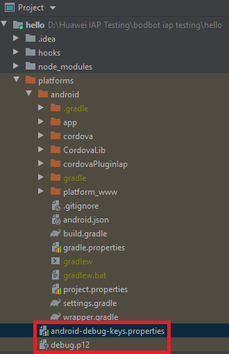
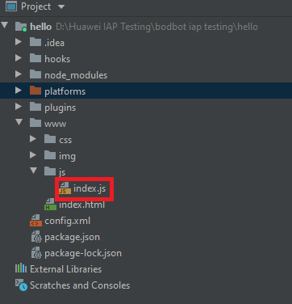

# Cordova-IAP-Plugin
HMS In-App Payment plugin for Cordova Android

Link to full Cordova project:
https://github.com/bryantvu/Cordova-HMS-IAP-Demo

## How to use

### Create Cordova Project
Initialize project: https://cordova.apache.org/docs/en/latest/guide/cli/
```shell
cordova create hello com.bvutest.iapdemo HelloWorld
```
Navigate into project folder
```shell
cd hello
```

Add Android platform
```shell
cordova platform add android
```

### Install Plugin
Download and extract files

Navigate to root folder and open shell
```shell
cordova plugin add /path/to/plugin/IapWrapper
```

### Copy Files
Copy 'android-debug-keys.properties' and 'debug.p12' from plugin root folder to /platforms in project


### Insert Demo Function
Add to www/js/index.js


```javascript
cordova.plugins.IapWrapper.getNonConsumables(
                success =>{
                    alert("success >> " + success);
                }, error => {
                    alert("fail >> " + error);
                });
```

### Run Demo
```shell
cordova run android
```
